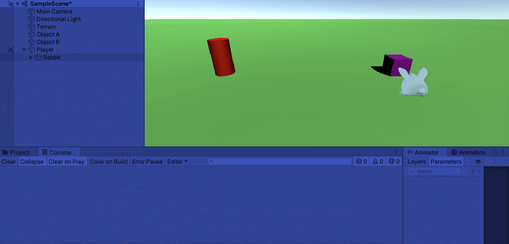
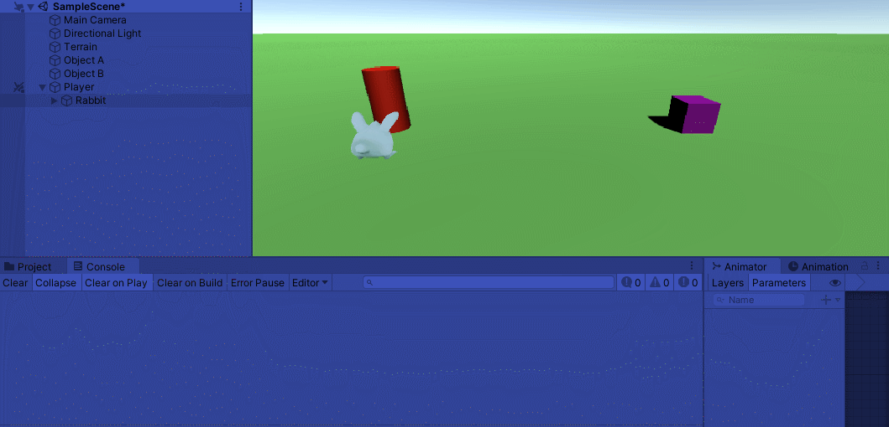
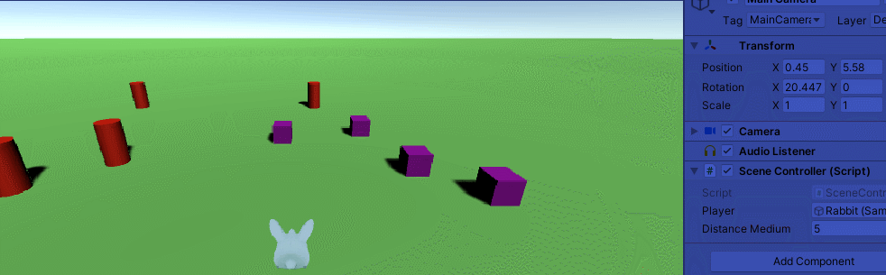
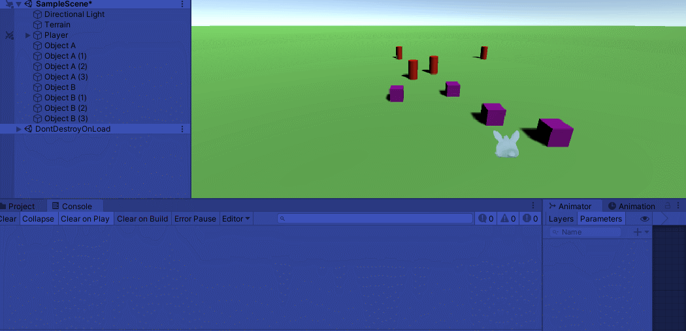
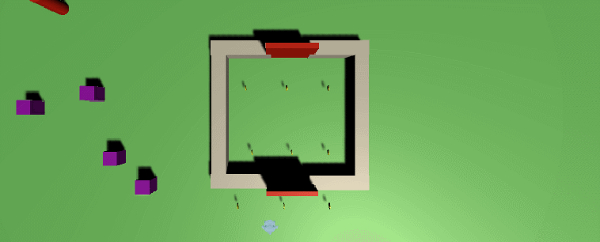
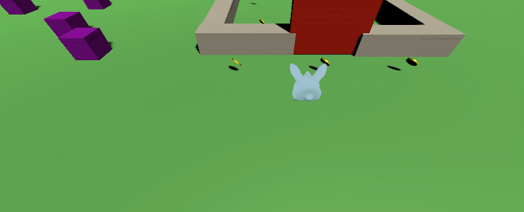

# Interface Inteligentes - Práctica 3

## 1. Agregar dos objetos en la escena: A y B. Cuando el jugador colisiona con un objeto de tipo B, el objeto A volcará en consola un mensaje. Cuando toca el objeto A se incrementará un contador en el objeto B.

Para la resolución del ejercicio he realizado lo siguiente. Primero, he creado dos objetos, un cilindro (objeto A) y un cuadrado (objeto B), cada uno de ellos tiene un script con la función correspondiente a lo que quiero que hagan. Posteriormente, he creado el objeto jugador (conejo) que contiene su propio script y, dentro de este, he establecido una referencia a cada uno de los otros dos objetos.

El objeto jugador es el que se encarga de detectar las colisiones con los objetos identificados con el tag "ObjectA" y "ObjectB" y cuando esto sucede, se llama a la función del objeto B y el objeto A respectivamente.

**Colision objeto B:**

**Colision objeto A:**

## 2. Implementar un controlador de escena usando el patrón delegado que gestione las siguientes acciones:

* ### Si el jugador dispara, los objetos de tipo A que estén a una distancia media serán desplazados y los que estén a una distancia pequeña serán destruidos. Los umbrales que marcan los límites se deben configurar en el inspector.

Para conseguir esto, primero establecí una función **dispararo** en el objeto **jugador**, de manera que, si detectaba que se presionaba la barra espaciadora, retornaba verdadero. Luego procedí a crear dos funciones en los objetos de tipo A, una que calculase la distancia al **jugador**, y otra  dependiendo, de si el jugador se encotraba a un cierto umbral de distancia establecida en el **SceneController**, estos objetos serian desplazados o eliminados.

* ### Si el jugador choca con objetos de tipo B, todos los de ese tipo sufrirán alguna transformación o algún cambio en su apariencia y decrementarán el poder del jugador.

En este caso, he creado una función que retorne si el jugador ha colisionado con este tipo de objetos y otra que decremete una variable interna que representa el **poder del jugador**; por otro lado, en los objetos de tipo B, he desarrollado una función que les permita cambiar su color. 

Por último, desde el **SceneController** he establecido que si se detecta la colsión del jugador con un objeto B, todos los demás de ese mismo tipo, procedieran a cambiar su color.

## 3. En la escena habrá ubicados un tipo de objetos que al ser recolectados por el jugador harán que ciertos obstáculos se desplacen desbloqueando algún espacio.

Lo primero que hice fue crear un objeto moneda que fuese de tipo *trigger* y además, le añadí una pequeña animación de rotación.

Luego en el objeto **jugador** establecí un atributo que fuese la cantidad de monedas que recopila, la función que desarrollé consiste en que cada vez que el **jugador** entrase en contacto con una moneda, esta sea eliminada y se aumente el contador establecido.

Desarrollé tambien un objeto **puerta** con un atributo que establece el número necesario de monedas para ser desplazada, y para este poder realizar este moviento, declaré un método que se encarga del mismo.

Por último, desde el **SceneController** se detecta cuando el jugador recolecta las monedas necesarias para el desplazamiento de una puerta concreta.

## 4. Incorporar un elemento que sirva para encender o apagar un foco utilizando el teclado.

Para resolver este apartado, he generado un objeto de tipo **Spot Light** y se lo he asignado a una de las propiedades del objeto **jugador**. Y que cuando se pulse el botón *F* el foco se active o se desactive (originalmente esta apagado).

